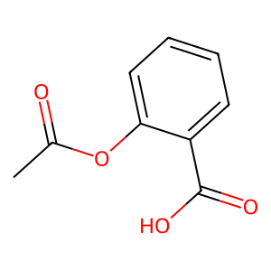
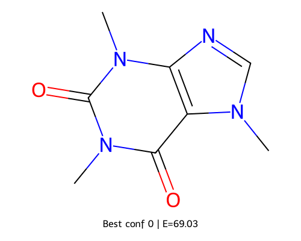
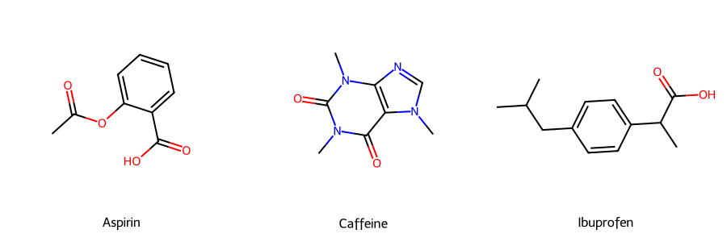

# 🧬 Pharma-AI Portfolio  
A modular, expanding portfolio demonstrating practical skills in **computational chemistry**, **structural bioinformatics**, and **AI-driven drug discovery**.  
Each section is a clean, self-contained workflow.

## 📚 Learning Journey: Tech to Pharma AI

This portfolio documents my transition from software engineering to pharmaceutical AI/ML, backed by structured learning in drug discovery fundamentals, computational chemistry, and AI applications in pharma.

**[View Complete Learning Path →](LEARNING_PATH.md)**

**Key Areas Covered:**
- Drug discovery process (target ID → clinical trials)
- Computational chemistry tools (RDKit, AlphaFold, AutoDock)
- ADMET prediction & molecular modeling
- AI/ML for drug design and property prediction

---

# 📁 Project Structure

```
pharma-ai-portfolio/
│
├─ alphafold_target_pipeline/           # Protein folding + structure analysis
│   ├─ data/                            # FASTA sequences
│   ├─ notebooks/
│   │   ├─ 01_run_alphafold_colab.ipynb
│   │   └── 02_structure_analysis.ipynb
│   ├─ output/
│   │   └─ structures/                  # PDBs + visualization images
│   ├─ images/
│   │   └─ structures/                  # PNG structural renderings
│   └─ src/                             # (future) pocket detection, scoring
│
├─ notebooks/                           # Small interactive workflows
│   ├─ fragment_based_drug_design.ipynb
│   ├─ molecular_property_analysis.ipynb
│   ├─ drug_analysis_demo.ipynb
│   ├─ Molecular Docking Preparation.ipynb
│
├─ src/                                 # Core reusable python modules
│   ├─ fragment_based_drug_design.py
│   ├─ molecular_docking_prep.py
│   ├─ molecular_property_analyzer.py
│
├─ images/                              # Molecular structure figures
│   ├─ aspirin.png
│   ├─ best_2d.png
│   └─ three_drugs.png
│
├─ output/
│   └─ molecular_analysis_results.csv
│
├─ FUTURE_WORK.md                       # Detailed pipeline expansion roadmap
├─ LEARNING_PATH.md                     # Tech to Pharma AI learning journey
└─ README.md
```

---

# 🧩 Included Pipelines

## **1️⃣ AlphaFold Target Pipeline**
A full structural-biology mini-workflow:

✔ Input FASTA  
✔ Predict 3D structure (ColabFold)  
✔ Visualize via `py3Dmol`  
✔ Highlight active site + cysteines  
✔ Export portfolio-ready images  

**Outputs:** → `alphafold_target_pipeline/output/structures/`

Examples:

- `dhfr_colored_cartoon.png`  
- `dhfr_active_site_surface.png`  
- `DHFR_rank1.pdb`

---

## **2️⃣ Fragment-Based Drug Design**
Explores:

- Fragmentation  
- Recombination  
- Scoring  
- Filtering  
- Visualization  

Notebook → `notebooks/fragment_based_drug_design.ipynb`  
Core script → `src/fragment_based_drug_design.py`

---

## **3️⃣ Molecular Property Analysis**
Computes RDKit-based descriptors:

✔ LogP  
✔ MW  
✔ HBD/HBA  
✔ PSA  
✔ Rule-of-5 metrics  

Notebook → `notebooks/molecular_property_analysis.ipynb`  
Output → `output/molecular_analysis_results.csv`

---

## **4️⃣ Docking Preparation**
Prepares molecules for docking:

✔ Protonation  
✔ Sanitization  
✔ Geometry optimization  
✔ SDF/MOL2/PDBQT export  

Notebook → `notebooks/Molecular Docking Preparation.ipynb`  
Script → `src/molecular_docking_prep.py`

---

# 🧪 Molecular Structure Examples

## Drug Molecule Visualizations

  
**Aspirin (Acetylsalicylic Acid)** - Common NSAID showing ester and carboxylic acid functional groups

  
**Caffeine Lowest Energy Conformer** - RDKit conformer analysis (E=-69.03 kcal/mol)

  
**Comparative Drug Structures** - Aspirin, Caffeine, and Ibuprofen side-by-side

These visualizations demonstrate 2D molecular rendering and conformer analysis using RDKit, core tools in computational drug discovery.

---

# 🧱 Installation

```bash
git clone https://github.com/yourusername/pharma-ai-portfolio.git
cd pharma-ai-portfolio
```

Create a virtual environment:

```bash
python -m venv venv
source venv/Scripts/activate    # Windows (Git Bash)
```

Install required libraries:

```bash
pip install -r requirements.txt
```

---

# 🧪 Dependencies

- RDKit  
- Numpy / Scipy  
- Pandas  
- Matplotlib  
- py3Dmol  
- Biopython  
- scikit-learn  

*(AlphaFold runs externally in Colab.)*

---

# 🖼️ Structural Images (DHFR)

All structural PNGs are stored here:

```
alphafold_target_pipeline/images/structures/
```

Includes:

- Rainbow cartoon  
- Greyscale cartoon  
- Atom sticks  
- Active site (red)  
- Cysteines (yellow)  
- Surface map  

---

# 🧬 About DHFR (Dihydrofolate Reductase)

DHFR is essential for:

- DNA synthesis  
- Folate metabolism  
- Cell growth  

Important drug target for:

- Cancer therapy (methotrexate)  
- Antimicrobials (trimethoprim)  

Ideal for showcasing structural biology + drug design skills.

---

# 🚀 Roadmap (Next Steps)

**[View Detailed Pipeline Expansion Plan →](FUTURE_WORK.md)**

**Upcoming phases to complete the full drug discovery pipeline:**

1. **Pose Analysis & Validation**  
   Interaction fingerprinting, RMSD clustering, redocking validation
   
2. **ADMET Filtering**  
   Lipinski/Veber rules, PAINS filtering, synthetic accessibility, drug-likeness

3. **Molecular Dynamics (Optional)**  
   Binding stability validation, H-bond analysis, MM/PBSA scoring

4. **Hit Optimization**  
   Fragment growing, scaffold hopping, SAR analysis, metabolic stability

5. **Final Selection & Ranking**  
   Integrated scoring, consensus ranking, lead identification

6. **Portfolio Packaging**  
   Pipeline visualization, results documentation, lessons learned

**Timeline:** 7-10 weeks for complete implementation  
**Current Focus:** Phase 7 - Pose Analysis & Validation  

---

# 🤝 Contributing
Pull requests welcome - this portfolio evolves over time.

---

# 📄 License
MIT License.
