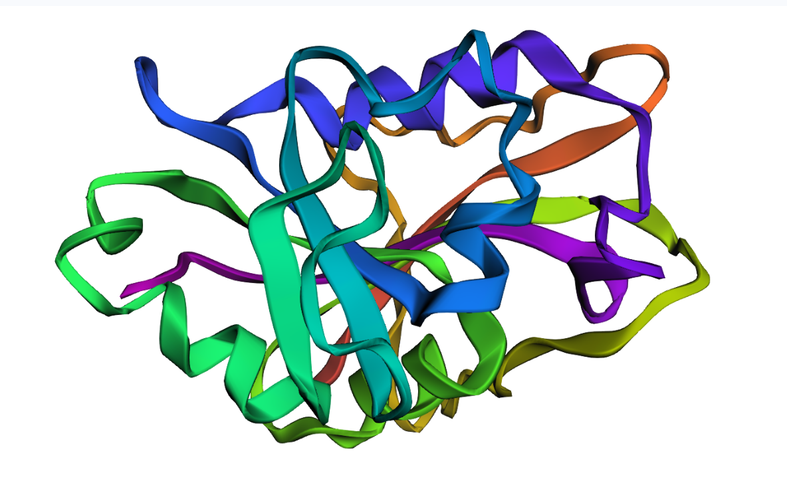
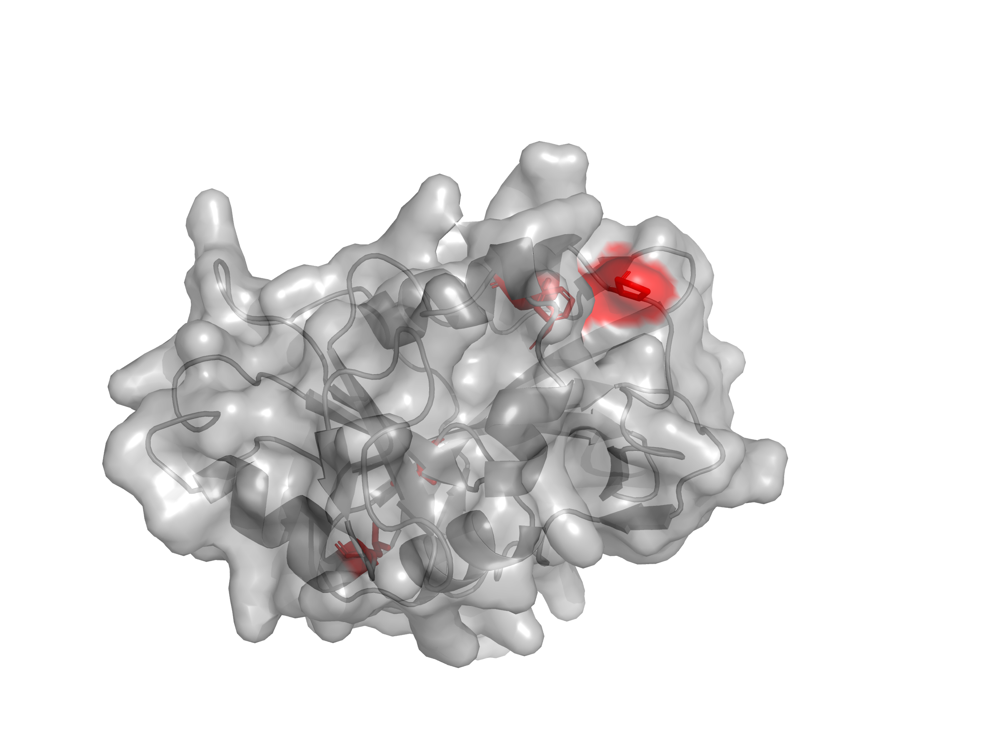
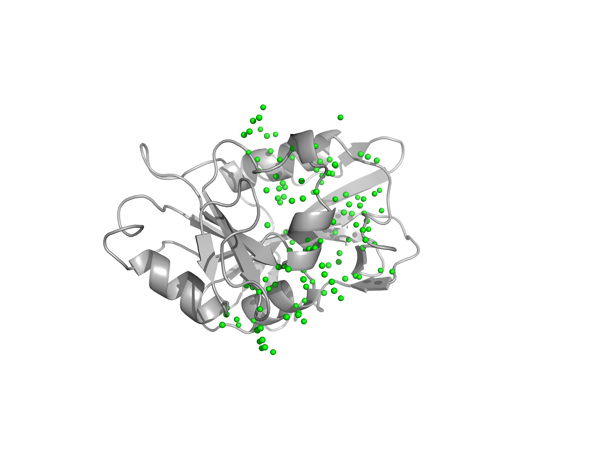
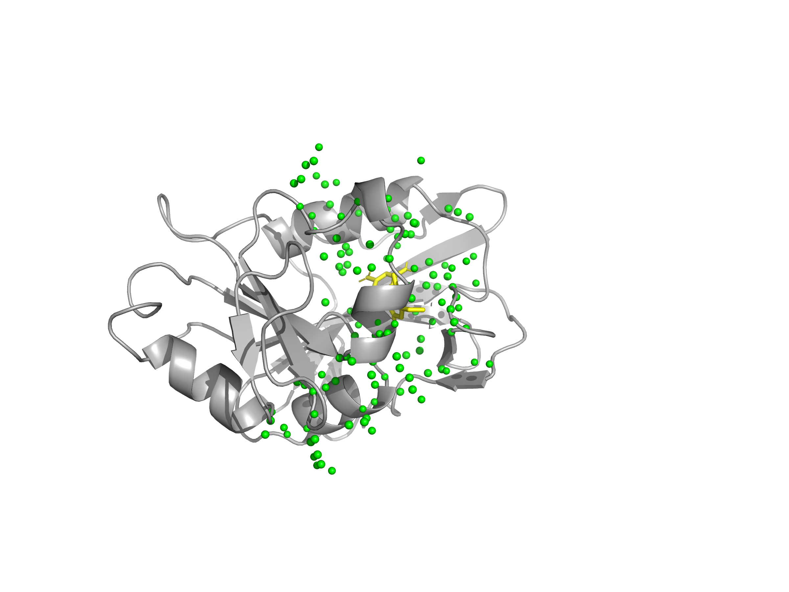
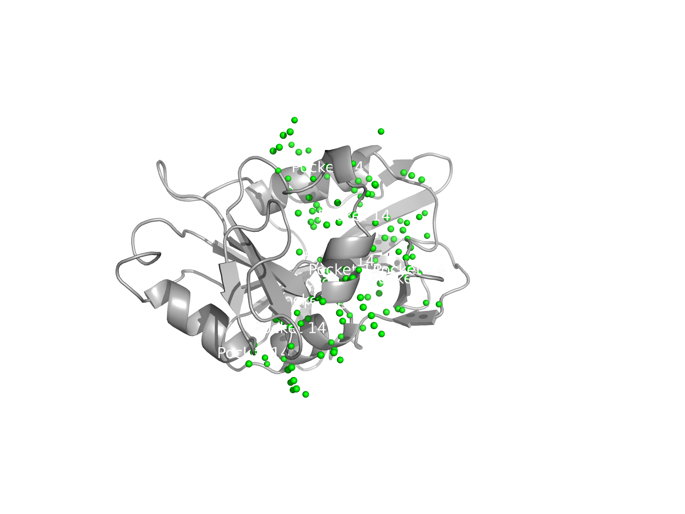
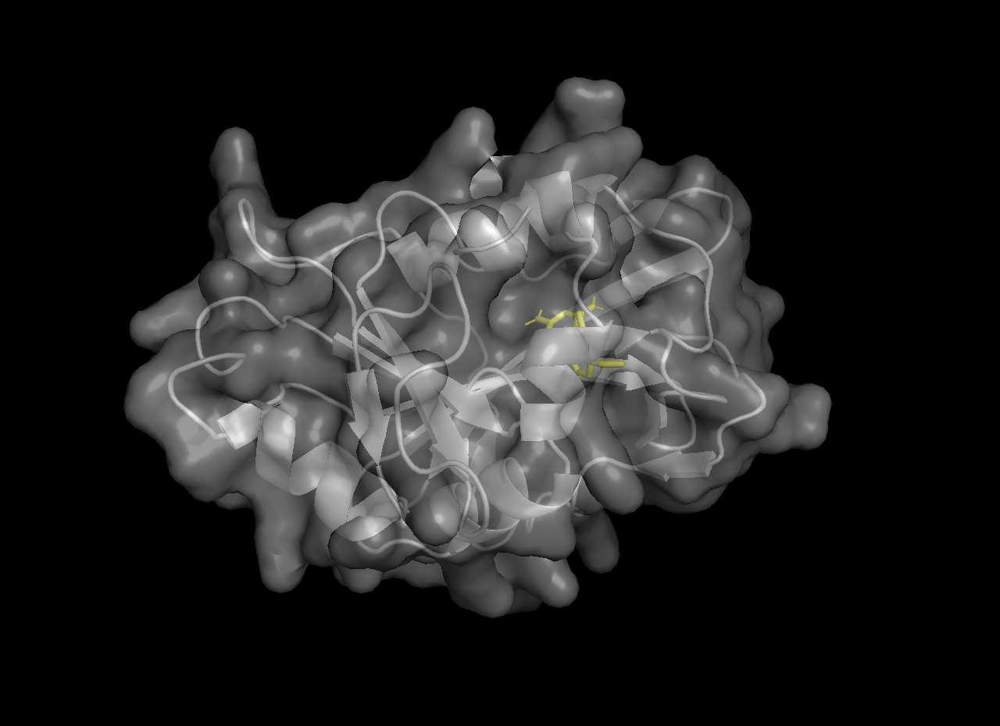
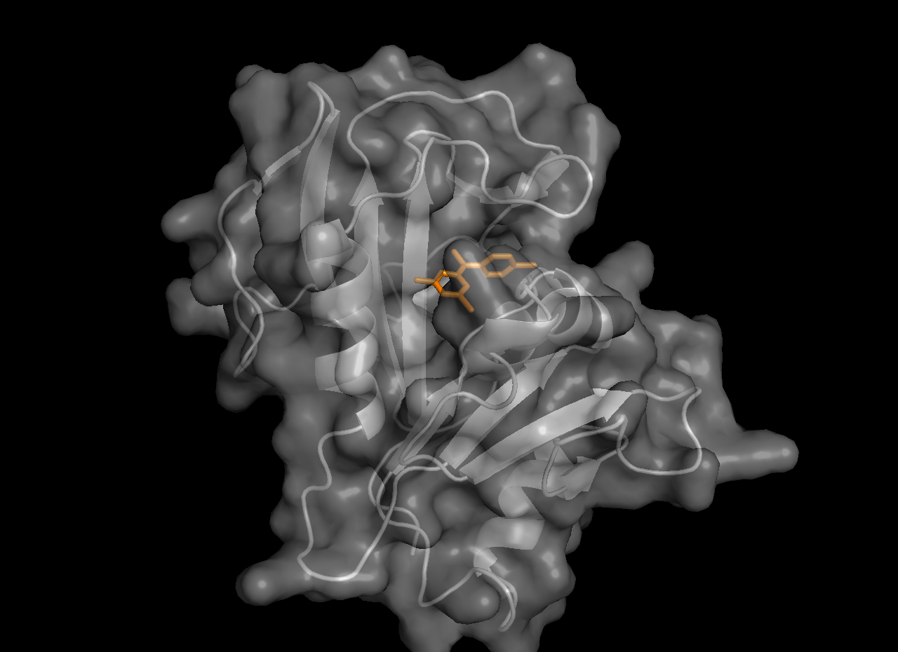
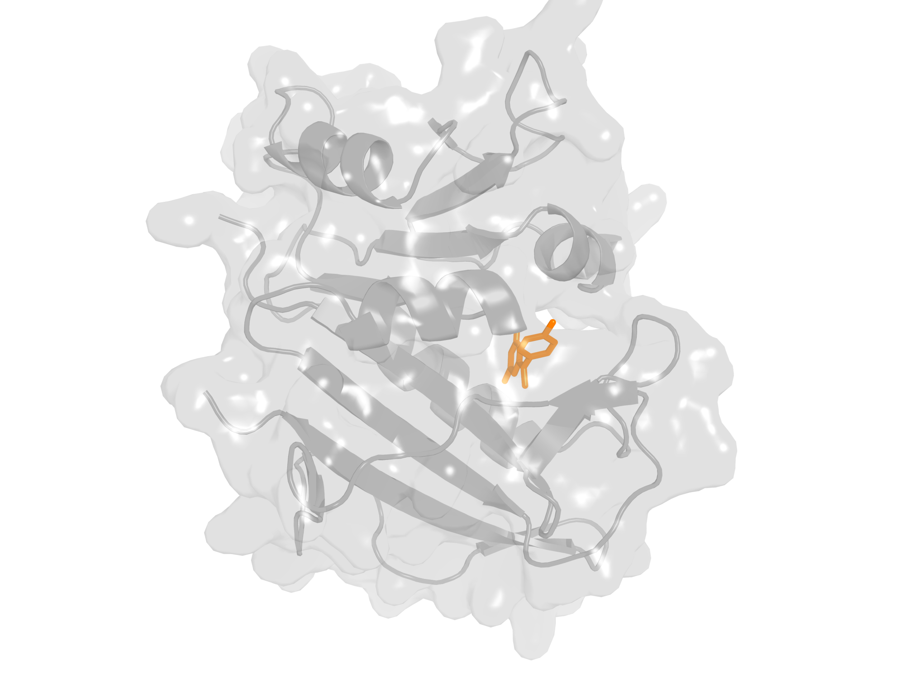

# AlphaFold Target Pipeline - DHFR

A complete workflow demonstrating:

- Running AlphaFold/ColabFold  
- Generating and analyzing protein structures  
- Producing high - quality structural images  
- Preparing ligands  
- Docking and pose evaluation  
- Visualizing ligand - protein interactions  

## Pipeline Overview

Input:
- DHFR protein sequence
- Small molecule ligands

Process:
- Predict DHFR structure using AlphaFold
- Analyse structure and identify binding pocket
- Prepare ligands for docking
- Dock ligands into the DHFR active site
- Inspect binding poses and interactions

Output:
- Docked ligand poses
- Visual evidence of binding
- Candidate inhibitors for further prioritisation

# Folder Structure

```text
alphafold_target_pipeline/
│
├── notebooks/
│   ├── 01_run_alphafold_colab.ipynb
│   └── 02_structure_analysis.ipynb
│
├── data/
│   ├── protein_sequence.fasta
│   ├── ligands/
│   └── protein/
│
├── images/
│   ├── protein_ligand_docking.png
│   └── structures/
│       ├── docking/
│       ├── interactions/
│       └── protein/
│
├── output/
│   ├── structures/
│   ├── docking/
│   └── vina/
│
└── src/
```

# Notebook Workflows

## 1. 01_run_alphafold_colab.ipynb  
Runs ColabFold to generate:

- Five ranked PDB models  
- MMseqs2-based MSA  
- PAE and pLDDT plots  
- Outputs stored in `output/structures/`

## 2. 02_structure_analysis.ipynb  
Visualization using py3Dmol and PyMOL, producing:

- Cartoon representations  
- Greyscale versions  
- All - atom stick models  
- Active-site residue views  
- Surface visualizations  

Saved in `images/structures/protein/`.

# Protein Structure Gallery

  
  
  
  
  
  

**Clean Active Site (PyMOL script‑generated)**  


## FPocket Pocket Visualizations

Pocket 14 - Clean surface + pocket atoms  


Pocket 14 - Pocket overlaid with ligand  


Pocket 14 - Annotated / labeled visualization  


# Docking Workflow

Purpose:
- Evaluate how known inhibitors bind to the DHFR active site
- Compare binding poses visually
- Support qualitative ranking of candidate molecules


Ligands:

```
data/ligands/
```

Protein structures:

```
data/protein/
```

Docking outputs:

```
output/docking/
output/vina/
images/structures/docking/
images/structures/interactions/
```

Docking and interaction images:

  
  
  



## Docking Results Summary

| Ligand           | Known Use        | Docking Evidence |
|------------------|------------------|------------------|
| Trimethoprim     | Antibacterial    | Stable binding pose in active site |
| Pyrimethamine    | Antiparasitic    | Clear interactions with DHFR residues |

These docking results provide structured inputs that can later be used to train or guide machine learning models for compound prioritisation.


# DHFR Summary

DHFR is central to:

- DNA synthesis  
- Folate metabolism  
- Cellular proliferation  

Targeted by:

- Methotrexate  
- Trimethoprim  
- Pyrimethamine  

A strong example target for structure-guided drug design.


# Future Extensions

- Pocket detection (fpocket, PyMOL)  
- Fragment elaboration  
- Interaction fingerprinting  
- Pose scoring and clustering  
- ADMET prediction  
- ML-guided ligand prioritization  


# Notes

This pipeline mirrors real workflows used in academic computational chemistry and industry structural biology.
